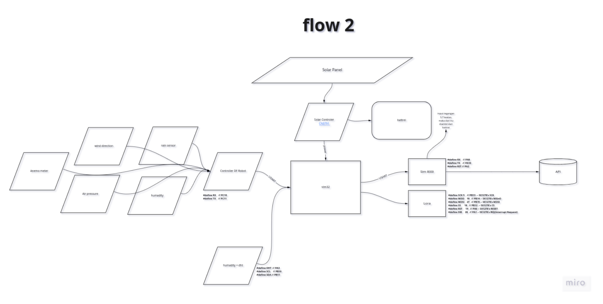
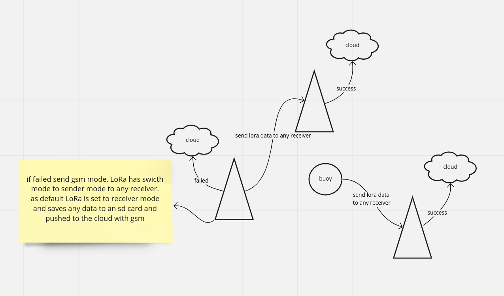
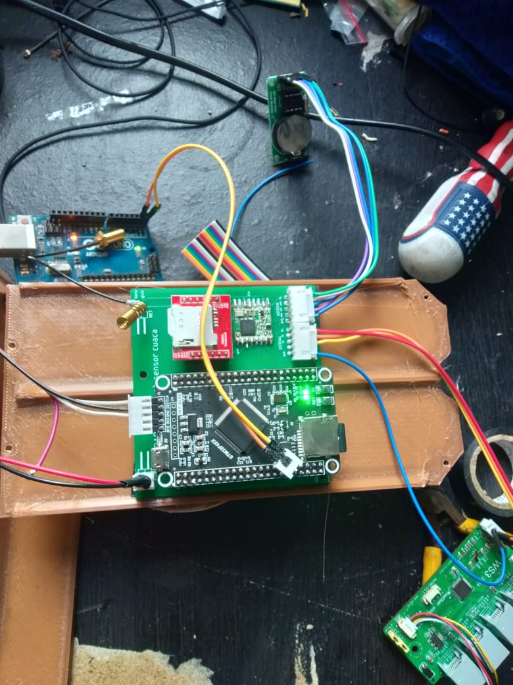
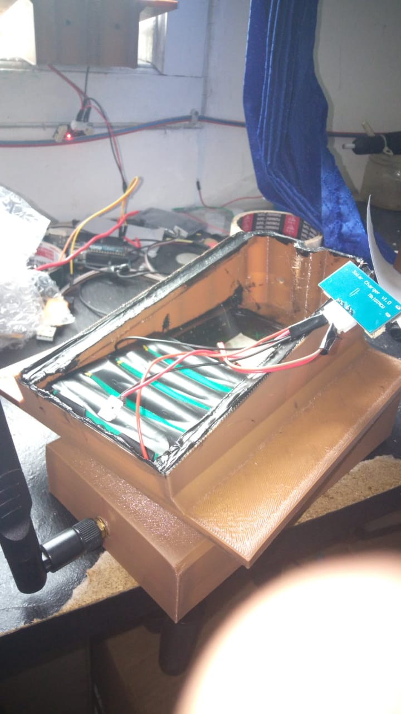
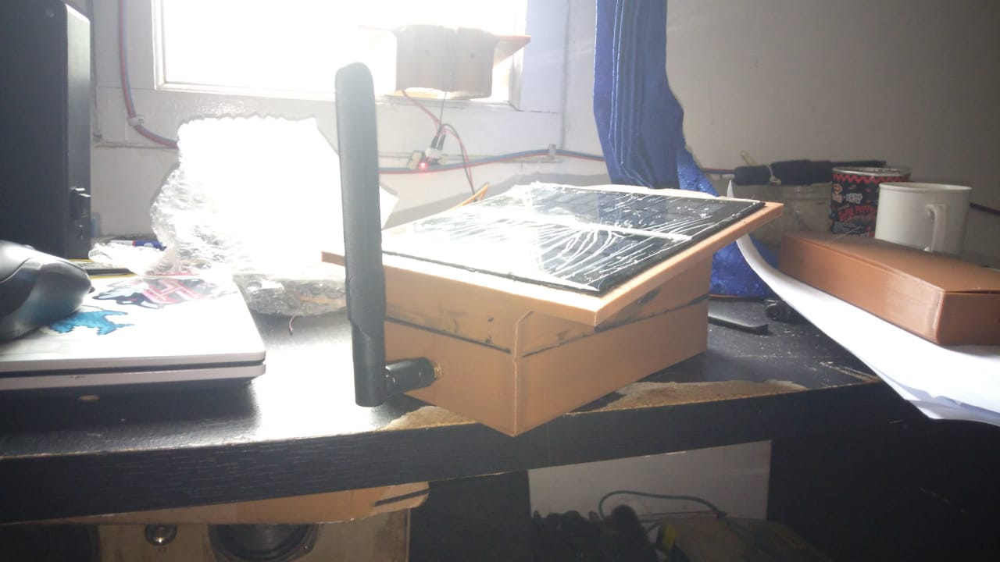

# OD-Automatic Weather Station

 

## Why are We Building OD-AWS?

## What is the OD-AWS?

## How does it work?

## Installation
Check out the [Wiki](https://github.com/Outsmarting-DIsaster/OD-AWS/wiki) to learn how to build your own Automatic Weather Station.

## Testing

From the project root, run the following snippet:

## Asembly

## How to Contribute

## License

This project is licensed under the MIT License - see the [LICENSE](LICENSE) file for details.

## Version

v1

[Outsmarting-Disaster]: <https://github.com/Outsmarting-Disaster>
